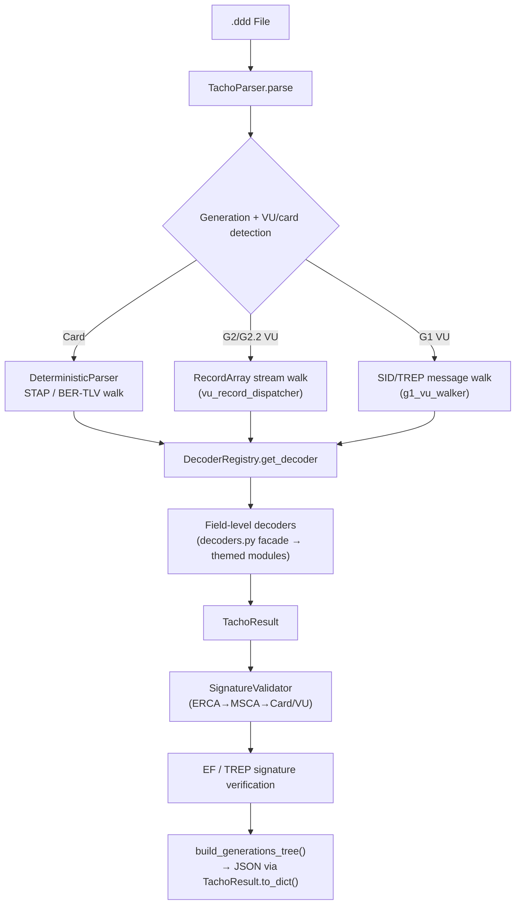
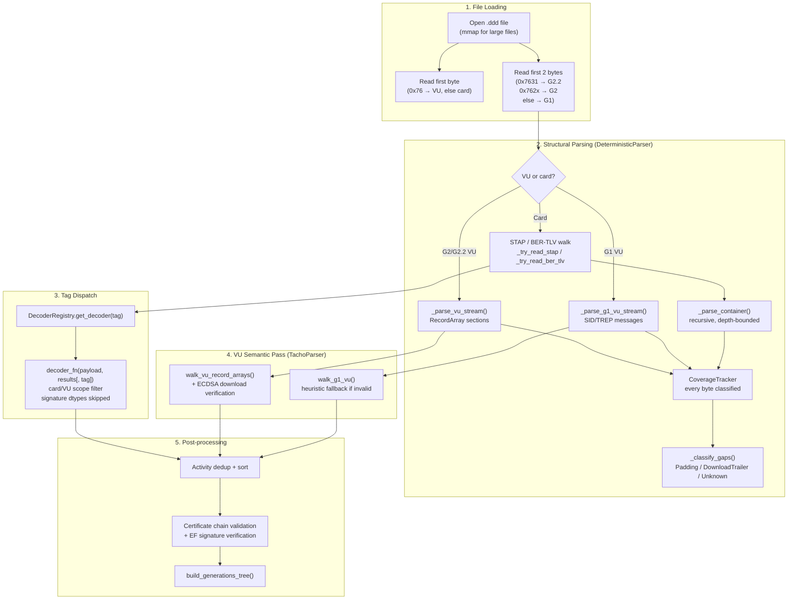

# Architecture

## Architecture Overview

The DDD Tachograph Reader follows a layered pipeline architecture with four main layers:

1. **Parser layer** — reads raw `.ddd` bytes, detects tachograph generation, walks STAP/BER-TLV structures and VU download streams deterministically, and dispatches field-level decoders
2. **Analysis layer** — validates certificate chains (ERCA/MSCA → Card/VU) and VU download signatures
3. **Export layer** — produces output in JSON, Excel (multi-sheet), CSV, and PDF formats
4. **GUI/CLI layer** — provides a tkinter GUI (`app/gui.py`) and `app/cli.py` command-line interface

### Key Design Patterns

**Registry Pattern** — `DecoderRegistry` (`core/registry/registry.py:28`) is the single source of truth mapping tag IDs to decoder functions. Each entry carries metadata: container flag, signature block, minimum length, record size, Annex reference, and generation. This enables lookup-by-tag without hardcoded switch statements.

**Strategy Pattern** — `DeterministicParser` (`core/parser/deterministic.py`) selects a walk per file kind:
- Card files: sequential STAP (G1, T2L2 headers) or BER-TLV (G2/G2.2) walk with container recursion
- G2/G2.2 VU downloads: RecordArray stream walk via `core/parser/vu_dispatcher.py` (Annex 1C Appendix 7)
- G1 VU downloads: SID/TREP message walk via `core/parser/g1_walker.py` (Annex 1B §2.2.6)

**Pipeline Pattern** — `parse → analyze → export`. `TachoParser.parse()` (`app/engine.py`) is a thin orchestrator over named phase methods: `_open_file → _run_structural_parse → _decode_vu_semantics → _dedup_and_sort_activities → _validate_certificate_chain → _verify_ef_signatures → build_generations_tree`.

### Flow Diagram



## Pipeline Flow (Detailed)



## Component Descriptions

### TachoParser (`app/engine.py`)

Entry point class. Constructor accepts the file path, records metadata, initializes `SignatureValidator`. `parse()` orchestrates named phases:
1. `_open_file()` — mmap + VU/card detection (first byte `0x76` = VU)
2. `_run_structural_parse()` — `DeterministicParser` walk with full byte coverage
3. `_decode_vu_semantics()` — VU only: RecordArray dispatch + ECDSA verification (G2/G2.2) or TREP walk (G1)
4. `_dedup_and_sort_activities()` — drop duplicate daily blocks, newest-first
5. `_validate_certificate_chain()` — ERCA → MSCA → Card/VU chain
6. `_verify_ef_signatures()` — per-EF data integrity against the card key
7. `build_generations_tree()` — hierarchical per-generation view

### DecoderRegistry (`core/registry/registry.py:28`)

Centralized tag → decoder mapping. Holds a `Dict[int, TagDecoder]` with entries for all known tags. Each `TagDecoder` dataclass contains:

| Field | Description |
|---|---|
| `tag` | Tag ID (integer) |
| `name` | Human-readable name |
| `decoder_fn` | Callable decoder function, or None for container-only |
| `container` | Whether inner data should be parsed recursively |
| `min_length` | Minimum payload length |
| `max_length` | Maximum payload length |
| `record_size` | Fixed record size for RecordArray decoding |
| `annex_ref` | Specification reference (e.g., "Annex 1B §2.15") |
| `generation` | "G1", "G2", "G2.2", or "all" |
| `card_only` / `vu_only` | Card/VU-specific |
| `signature_block` | Marked for signature validation |
| `priority` | Dispatch priority (higher = sooner) |

Key methods: `get_decoder(tag)`, `is_container(tag)`, `is_signature(tag)`, `get_by_generation(gen)`, `get_unhandled_tags(seen_tags)`.

### DeterministicParser (`core/parser/deterministic.py:105`)

Schema-driven two-pass parser (migration target). Architecture:
1. **Structural pass**: Sequentially parses the file using `_try_read_stap()` or `_try_read_ber_tlv()`, dispatching through `DecoderRegistry.get_decoder()` and recursing into containers
2. **Semantic pass**: (reserved for future) Validates record sizes, checksums, and field ranges

Uses `CoverageTracker` (`core/parser/deterministic.py:18`) to track exact byte ranges covered, with classifications (Tag, Padding, Unknown). Guarantees 100% coverage by construction.

### Decoders (`core/decoders/__init__.py` facade + themed modules)

Field-level byte decoders, split by scope. `core/decoders/__init__.py` is a facade that re-exports every decoder, so the registry and other modules import from a single place:

| Module | Contents |
|---|---|
| `core/decoders/common.py` | Shared helpers: nations, code-page strings, dates, activity values, cyclic activity buffers |
| `core/decoders/card_ef.py` | Card EFs (multi-generation): ICC/IC, identification, licence, events/faults, places, vehicles used, calibrations, control activities, company data |
| `core/decoders/card_g22.py` | G2.2 card tags: GNSS accumulated driving, load/unload, trailers, enhanced places, load sensor, border crossings |
| `core/decoders/cert.py` | Certificates: G1 RSA profiles, signatures, public keys, G2.2 CVC profiles and auth sub-tags |
| `core/decoders/vu_g1.py` | G1 VU download messages: overview + TREP 02–06 stream walkers |
| `core/decoders/vu_g2.py` | G2/G2.2 VU RecordArray dispatch (`parse_g2_vu_record`) |

`core/decoders/vu_g2.py` dispatches G2/G2.2 VU RecordArray records to the
record-type decoders in `core/parser/vu_dispatcher.py`:
- `decode_vu_card_record()` (0x0509): card records
- `decode_card_iw()` (0x050A): insertion/withdrawal records
- `parse_g2_vu_record()`: Generic dispatcher for all G2/G2.2 VU record types using RecordArray format

### Models (`core/registry/models.py`)

`TachoResult` dataclass hierarchy:

```
TachoResult
├── metadata: filename, generation, parsed_at, integrity_check, file_size_bytes, coverage_pct
├── driver: card_number, surname, firstname, birth_date, expiry_date, issuing_nation, ...
├── vehicle: vin, plate, registration_nation
├── activities: List[Dict] — daily driver activities
├── vehicle_sessions: List[Dict] — vehicles used over time
├── events: List[Dict] — recorded events
├── faults: List[Dict] — recorded faults
├── locations: List[Dict] — GNSS positions
├── places: List[Dict] — recorded places
├── calibrations: List[Dict] — calibration records
├── raw_tags: Dict[str, List[Dict]] — raw tag occurrences
├── signatures: List[Dict]
├── gnss_ad_records: List[Dict] — G2.2 GNSS accumulated driving
├── load_unload_records: List[Dict]
├── trailer_registrations: List[Dict]
├── gnss_places: List[Dict]
├── load_sensor_data: List[Dict]
├── border_crossings: List[Dict]
└── signed_daily_records: List[Dict]
```

`build_generations_tree()` (line 113) organizes results into a hierarchical view: `{Generation 1: {...}, Generation 2: {...}, Generation 2.2: {...}}`.

### SignatureValidator (`core/crypto/signature.py:10`)

Validates digital certificate chains. Supports RSA (G1/G2) and ECDSA (G2). Hierarchy:
- **ERCA** (European Root Certificate Authority) — root certificates in `certs/`
- **MSCA** (Member State Certificate Authority) — intermediate certificates
- **Card/VU** — leaf certificates signed by MSCA

### Export Layer

- **ExportManager** (`app/export.py:5`): Multi-sheet Excel (Riepilogo, Attività Giornaliere) and CSV export

### GUI Layer

- **app/gui.py**: Desktop application (tkinter/ttk). Regedit-style section tree on the left, Excel-style data table on the right (sortable columns, text filter). Data-driven: sections are derived from the parser output.
- **app/cli.py** (`app/cli.py:14`): CLI with `--json`, `--excel`, `--all`, `--summary` flags
