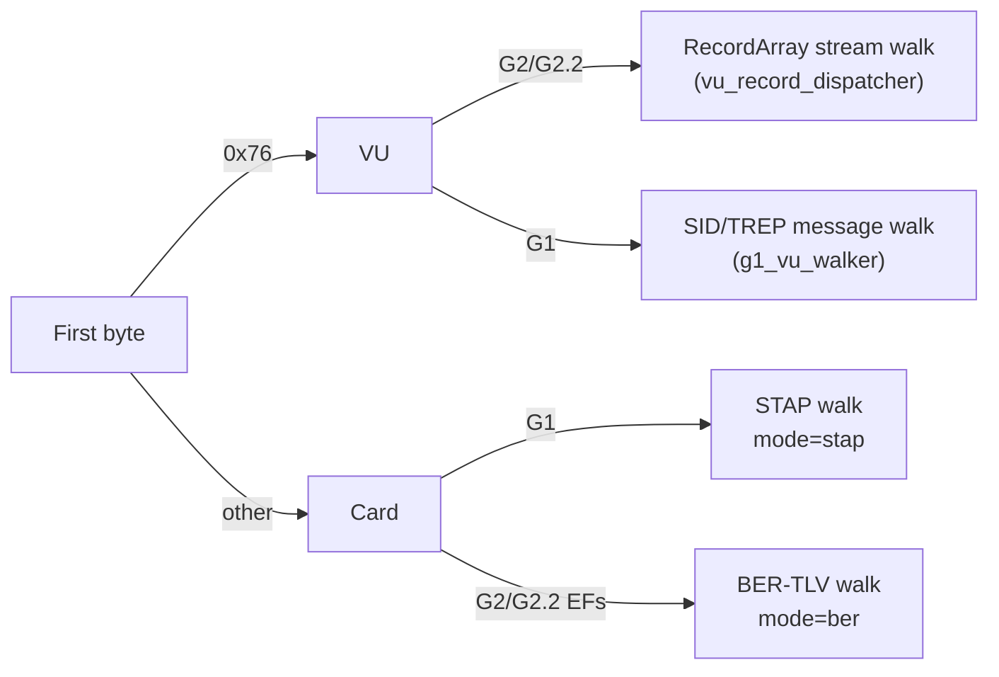

# Parsing Pipeline

Deep dive into the DDD tachograph parsing formats and pipeline stages. All parsing is done by `DeterministicParser` (`core/parser/deterministic.py`); the legacy recursive parser (`TagNavigator`) has been removed.

## Generation Detection

`DeterministicParser._detect_generation()` reads the first 2 bytes of the file:

```python
if header == b'\x76\x31': return "G2.2"
elif header in (b'\x76\x21', b'\x76\x22'): return "G2"
return "G1"
```

Card files carry no `0x76` header, so header sniffing always yields G1 for them; `_refine_card_generation()` upgrades the label after parsing when Gen2 EF copies (appendix dtype `0x02`/`0x03`) or Gen2.2-only EFs (`0x0525`–`0x052A`) are present.

**VU vs Card** (`TachoParser._open_file()`): if the first byte is `0x76`, `is_vu = True`. This selects the VU stream walkers and filters which decoders are dispatched (VU-only vs card-only tags).

### Mode Selection



## STAP Format (G1 — Annex 1B)

STAP (Secure Tag Application Protocol) uses a fixed 5-byte header per record known as T2L2:

```
┌─────────────┬──────────┬───────────┬──────────────┐
│  Tag (2 B)  │DType (1B)│Length (2B)│ Value (N B)  │
│  Big-endian │          │ Big-endian│              │
└─────────────┴──────────┴───────────┴──────────────┘
   Bytes 0-1     Byte 2    Bytes 3-4   Bytes 5..5+N-1
```

- **Tag**: 16-bit tag ID in big-endian
- **DType**: Data type (0 = raw, 1 = certificate/signature, 6 = G2 daily activity, etc.)
- **Length**: 16-bit payload length in big-endian
- **Value**: Payload bytes

Parsing is done by `DeterministicParser._try_read_stap()` with sanity checks that reject impossible records:

```python
tag, dtype, length = struct.unpack(">HBH", hdr)
if tag in (0x0000, 0xFFFF, 0x5555): return None   # null/padding tags
if dtype > 0x0F: return None
if length > MAX_TLV_LENGTH: return None
if pos + 5 + length > end: return None
```

## BER-TLV Format (G2/G2.2 — Annex 1C)

BER-TLV (Basic Encoding Rules — Tag Length Value) uses variable-length tag and length encoding:

### Tag Encoding

```
First byte:   bits 7-6 = class (00=universal, 01=application, 10=context, 11=private)
              bit 5    = constructed (1=container)
              bits 4-0 = tag number

If bits 4-0 == 0x1F (all 1s), tag continues in subsequent bytes:
   Subsequent bytes: bit 7 = continuation (1=more, 0=last)
                     bits 6-0 = next 7 bits of tag number
```

### Length Encoding

```
If first length byte < 0x80:
    Length = that byte (short form)
Else:
    Lower 7 bits = number of subsequent length bytes (1-3)
    Those bytes = length value (long form, big-endian)
```

### Implementation

The shared header reader is `read_ber_tlv_header()` (`core/utils/ber_tlv.py`), called by `DeterministicParser._try_read_ber_tlv()`:

```python
b0 = data[pos]
if b0 in (0x00, 0xFF): return None, None, 0  # skip null/padding
tag = b0
if (b0 & 0x1F) == 0x1F:  # multi-byte tag
    while pos < n:
        b = data[pos]; pos += 1
        tag = (tag << 8) | b
        if not (b & 0x80): break

lb = data[pos]; pos += 1
if lb < 0x80: length = lb           # short form
else:
    nb = lb & 0x7F                  # number of length bytes (1-3)
    length = int.from_bytes(data[pos:pos+nb], 'big')
```

It returns `(tag, length, header_size)` and never reads the payload; callers slice it.

## VU Download Streams

VU downloads are **not** plain TLV at the top level — they are SID/TREP message streams. The structural pass routes them to dedicated walkers:

- **G2/G2.2 VU** (`DeterministicParser._parse_vu_stream()`): walks the sections produced by `core/vu_record_dispatcher.iter_vu_sections()`. Each section is a `0x76 TREP` marker followed by RecordArray blocks keyed by **recordType** (Annex 1C Appendix 7). Walking these bytes as BER would misread `0x76` as a 1-byte tag and classify garbage.
- **G1 VU** (`DeterministicParser._parse_g1_vu_stream()`): walks SID/TREP messages with structure-determined lengths via `core/g1_vu_walker.iter_g1_vu_messages()` (Annex 1B §2.2.6), including the trailing RSA signature of each message. Falls back to the generic TLV walk when the stream does not validate (truncated or synthetic files).

Semantic decoding of the same streams happens in `TachoParser._decode_vu_semantics()`: `walk_vu_record_arrays()` for G2/G2.2 (with `parse_vu_download_messages()` as heuristic fallback) and `walk_g1_vu()` for G1.

## RecordArray Format (G2 VU — Annex 1C Appendix 7)

G2 VU records (tags `0x0509`-`0x0512`, `0x052B`-`0x0533`) use a RecordArray structure:

```
┌──────────────────┬─────────────┬─────────────┬─────┐
│ Record Count (2B)│RecordSize(2B)│Record 1 (N)│ ... │
└──────────────────┴─────────────┴─────────────┴─────┘
```

`DeterministicParser._dispatch_decoder()` inspects the decoder signature: tag-aware decoders (three required parameters) receive the tag so they can slice records per record type:

```python
n_params = len(required_params(dec.decoder_fn))
if n_params == 3:
    dec.decoder_fn(payload, self.results, tag)
else:
    dec.decoder_fn(payload, self.results)
```

Individual record parsers live in `core/parser/vu_dispatcher.py`, dispatched through `core/decoders/vu_g2.py`.

## Container Recursion

Containers are tags whose payload contains nested sub-structures that must be recursively parsed. Containment is decided by `DecoderRegistry.is_container()`:

1. **Registry flag**: `TagDecoder` entries declared with `container=True`.
2. **0x76xx prefix**: any tag matching `(tag & 0xFF00) == 0x7600` is treated as a VU container.

`DeterministicParser._parse_container()` then walks the payload recursively (STAP or BER mode per the decoder's generation), skipping inner padding runs and bounding depth at `MAX_RECURSION_DEPTH`. VU application containers (`0x76xx` with a `0x00` filler byte) skip the 2-byte inner prefix.

## Coverage Tracking

### CoverageTracker (`core/parser/deterministic.py`)

Every byte of the file ends up in exactly one bucket. The tracker records:
- `covered_ranges`: list of `(start, end)` byte intervals
- `classifications`: dict of `{classification_name: byte_count}` (e.g. `Tag_0504`, `Padding(0xFF)`, `Unknown`)
- `unknown_ranges`: list of `(start, end, data)` for bytes not matched to any structure

Key methods:
- `mark_covered(start, end)` — register a covered byte range
- `mark_classified(start, end, classification)` — register with a classification label
- `mark_padding(start, end, fill_byte)` — register as padding
- `mark_unknown(start, end, data)` — register as unknown/undecoded (raw bytes kept for triage)
- `merge_ranges()` — merge overlapping/adjacent ranges
- `get_coverage_pct()` — percentage of file covered
- `get_uncovered_ranges()` — gaps after merging
- `get_section_report(file_size)` — per-section coverage breakdown

After the walk, `_classify_gaps()` sweeps the uncovered ranges: runs of `0x00`/`0xFF`/`0x55` become `Padding`, a short `0x76 0x00` trailer at EOF becomes `DownloadTrailer`, anything else is marked `Unknown` and surfaced as "Unparsed Data" in `raw_tags`.

## Padding Handling

Three padding byte values are recognized: `0x00`, `0xFF`, `0x55` (see `core/utils/coverage.py`). Consecutive identical padding bytes are aggregated into a single `Padding` raw_tag entry, both at the top level (`_skip_padding`) and inside containers (`_skip_padding_inner`).

## Data Type (DType) Values

| DType | Meaning | Handling |
|---|---|---|
| 0 | Raw data | Normal decoding |
| 1 | Certificate / signature | Skip decoding, record only |
| 2, 3 | Gen2 EF copy / its signature | Collected for EF signature verification |
| 6 | G2 daily activity record | Normal decoding |
| 11, 15 | Signature blocks | Skip decoding |
