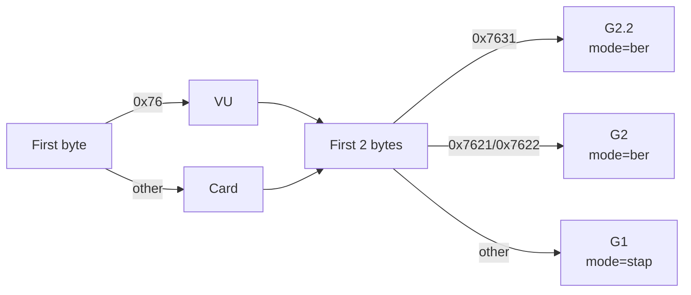

# Parsing Pipeline

Deep dive into the DDD tachograph parsing formats and pipeline stages.

## Generation Detection

Generation detection happens in two places:

**Legacy path** (`ddd_parser.py:134-147`): Reads the first 2 bytes of the file:
```python
header = self._safe_read(0, 2)
if header == b'\x76\x31':
    # G2.2 (Smart V2)
elif header in (b'\x76\x21', b'\x76\x22'):
    # G2 (Smart)
else:
    # G1 (Digital)
```

**Deterministic path** (`core/deterministic_parser.py:188-196`): Same logic, wrapped in `_detect_generation()`:
```python
if header == b'\x76\x31': return "G2.2"
elif header in (b'\x76\x21', b'\x76\x22'): return "G2"
return "G1"
```

**VU vs Card** (`ddd_parser.py:132`): If `first_byte == b'\x76'`, `self.is_vu = True`. This affects which decoders are dispatched (VU-only vs card-only tags).

### Mode Selection



## STAP Format (G1 — Annex 1B)

STAP (Secure Tag Application Protocol) uses a fixed 5-byte header per record known as T2L2:

```
┌─────────────┬──────────┬───────────┬──────────────┐
│  Tag (2 B)  │DType (1B)│Length (2B)│ Value (N B)  │
│  Big-endian │          │ Big-endian│              │
└─────────────┴──────────┴───────────┴──────────────┘
   Bytes 0-1     Byte 2    Bytes 3-4   Bytes 5..5+N-1
```

- **Tag**: 16-bit tag ID in big-endian
- **DType**: Data type (0 = raw, 1 = certificate/signature, 6 = G2 daily activity, etc.)
- **Length**: 16-bit payload length in big-endian
- **Value**: Payload bytes

Parsing is done by `TagNavigator.parse_stap_recursive()` (`core/tag_navigator.py:38`) at depth 0:

```python
hdr = self.parser._safe_read(pos, 5)
tag, dtype, length = struct.unpack(">HBH", hdr)
# Skip null/padding tags (0x0000, 0xFFFF, 0x5555)
if tag in (0x0000, 0xFFFF, 0x5555): break
```

The deterministic parser's equivalent is `DeterministicParser._try_read_stap()` (`core/deterministic_parser.py:247`):

```python
tag, dtype, length = struct.unpack(">HBH", hdr)
if tag in (0x0000, 0xFFFF, 0x5555): return None
if dtype > 0x0F: return None
if length > 0x100000: return None
```

## BER-TLV Format (G2/G2.2 — Annex 1C)

BER-TLV (Basic Encoding Rules — Tag Length Value) uses variable-length tag and length encoding:

### Tag Encoding

```
First byte:   bits 7-6 = class (00=universal, 01=application, 10=context, 11=private)
              bit 5    = constructed (1=container)
              bits 4-0 = tag number

If bits 4-0 == 0x1F (all 1s), tag continues in subsequent bytes:
   Subsequent bytes: bit 7 = continuation (1=more, 0=last)
                     bits 6-0 = next 7 bits of tag number
```

### Length Encoding

```
If first length byte < 0x80:
    Length = that byte (short form)
Else:
    Lower 7 bits = number of subsequent length bytes (1-3)
    Those bytes = length value (long form, big-endian)
```

### Implementation

Parsed by `TagNavigator.read_ber_tlv()` (`core/tag_navigator.py:14`):

```python
b0 = data[pos]
if b0 in (0x00, 0xFF): return None, None, 0  # skip null/padding
tag = b0
if (b0 & 0x1F) == 0x1F:  # multi-byte tag
    while pos < len(data):
        b = data[pos]; pos += 1
        tag = (tag << 8) | b
        if not (b & 0x80): break

lb = data[pos]; pos += 1
if lb < 0x80: length = lb           # short form
else:
    nb = lb & 0x7F                  # number of length bytes
    length = int.from_bytes(data[pos:pos+nb], 'big')
    pos += nb
```

The deterministic parser's equivalent is `_try_read_ber_tlv()` (`core/deterministic_parser.py:268`).

## RecordArray Format (G2 VU — Annex 1C Appendix 7)

G2 VU records (tags `0x0509`-`0x0512`, `0x052B`-`0x0533`) use a RecordArray structure:

```
┌──────────────────┬─────────────┬─────────────┬─────┐
│ Record Count (2B)│RecordSize(2B)│Record 1 (N)│ ... │
└──────────────────┴─────────────┴─────────────┴─────┘
```

The deterministic path in `_dispatch_decoder()` (`core/deterministic_parser.py:351`) passes the tag to the decoder for record-type-specific slicing:

```python
if tag in (0x0509, 0x050A, 0x050B, 0x050D, 0x050F,
           0x0510, 0x0511, 0x0512, 0x052B, 0x052C,
           0x052D, 0x052E, 0x052F, 0x0530, 0x0531, 0x0532, 0x0533):
    dec.decoder_fn(payload, self.results, tag)
```

Individual record parsers live in `core/g2_decoders.py`, each accepting `(data, offset)`.

## Container Recursion

Containers are tags whose payload contains nested sub-structures that must be recursively parsed. The system determines containment via:

1. **Explicit `CONTAINER_TAGS` set** in `TagNavigator.dispatch_container_if_needed()` (`core/tag_navigator.py:525`):
   ```python
   CONTAINER_TAGS = {
       0x7621, 0x7622, 0x7623, 0x7624,  # G2 VU
       0x7631, 0x7632, 0x7633, 0x7634,  # G2.2 VU
       0x7601, 0x7602, 0x7603, 0x7604,  # G1 VU
       0x7F21, 0x7D21, 0xAD21, 0x7F4E, 0x7F60, 0x7F61,  # Security
       0x0525, 0x0526, 0x0527, 0x0528, 0x0529, 0x052A,  # G2.2 leaf containers
       0x0225, 0x0226, 0x0227, 0x0228  # G2.2 VU leaf containers
   }
   ```

2. **BER constructed bit**: In BER-TLV mode, if bit 5 of the first tag byte is set, the tag is a container:
   ```python
   if mode == 'annex1c' and tag > 0xFF:
       first_byte = (tag >> ((tag.bit_length() - 1) // 8 * 8)) & 0xFF
       if first_byte & 0x20: is_container = True
   ```

3. **0x7600 prefix heuristic**: Any tag matching `(tag & 0xFF00) == 0x7600` is treated as a VU container.

4. **`NO_RECURSE_TAGS`** (line 534): Tags that have dedicated decoders handling their inner data — `{0x7F49, 0x5F37, 0x42, 0x4208}` — are excluded from container recursion.

### Container inner data handling

- **G1 VU containers** (`0x7601`-`0x7604`): The `parse_g1_vu_overview()` decoder extracts fixed-offset data via heuristic text scan, then inner data is parsed as STAP records
- **G2/G2.2 activity containers** (`0x7622`/`0x7632`): If the payload starts with `0x6864` (TREP marker), `_parse_trep_02_activities()` handles inner data. Otherwise, parsed as BER-TLV
- **Certificate containers** (`0x7F21`, `0x7D21`, `0xAD21`): Parsed as BER-TLV substructures

## Coverage Tracking

### CoverageTracker (`core/deterministic_parser.py:18`)

Used by `DeterministicParser`. Tracks:
- `covered_ranges`: List of `(start, end)` byte intervals
- `classifications`: Dict of `{classification_name: byte_count}`
- `unknown_ranges`: List of `(start, end, data)` for bytes not matched to any tag

Key methods:
- `mark_covered(start, end)` — register a covered byte range
- `mark_classified(start, end, classification)` — register with a classification label
- `mark_padding(start, end, fill_byte)` — register as padding
- `mark_unknown(start, end, data)` — register as unknown/undecoded
- `merge_ranges()` — merge overlapping/adjacent ranges
- `get_coverage_pct()` — return percentage of file covered
- `get_uncovered_ranges()` — return gaps after merging

### `_fill_coverage_gaps()` (`ddd_parser.py:82`)

Used in the legacy (non-deterministic) parsing path. Guarantees 100% coverage:

1. Collects all byte ranges from `results["raw_tags"]`
2. Merges overlapping ranges
3. Any gap between merged ranges is filled via `record_unparsed()` as `GAP_FILLER`
4. After filling, `bytes_covered = file_size` (perfect coverage)

```python
covered_ranges = []
for occs in self.results.get("raw_tags", {}).values():
    for occ in occs:
        off = int(occ["offset"], 16)
        length = occ.get("length", 0)
        if length > 0:
            covered_ranges.append((off, off + length))

# Sort and merge
covered_ranges.sort()
merged = []
for rng in covered_ranges:
    if rng[0] >= rng[1]: continue
    if merged and rng[0] <= merged[-1][1]:
        merged[-1] = (merged[-1][0], max(merged[-1][1], rng[1]))
    else:
        merged.append(rng)

# Fill gaps
cursor = 0
for s, e in merged:
    if cursor < s:
        self.navigator.record_unparsed(cursor, s, 0, "GAP_FILLER")
    cursor = max(cursor, e)
if cursor < self.file_size:
    self.navigator.record_unparsed(cursor, self.file_size, 0, "GAP_FILLER")
```

## Deep Scan (`core/tag_navigator.py:161`)

Heuristic recovery pass that runs after the initial recursive parse. Steps:

1. Finds all `raw_tags` entries with "Unparsed Data" and length > 10 bytes
2. For each unparsed block, runs a sliding window (1-byte step) trying both STAP and BER-TLV at each position
3. If a known tag is found, recursively parses that sub-region
4. STAP validation: tag must be in known tags, dtype ≤ 0x04 (or specific G2 record tags), and payload fits within the block
5. BER validation: tag must be in known tags and payload fits

```python
while pos < end - 4:
    # Try STAP
    hdr = self.parser._safe_read(pos, 5)
    if hdr:
        tag, dtype, length = struct.unpack(">HBH", hdr)
        if tag in known_tags and dtype_ok and pos + 5 + length <= end:
            self.parse_stap_recursive(pos, pos + 5 + length, ...)
            pos += 5 + length; found = True
    # Try BER as fallback
    if not found:
        tag, length, h = self.read_ber_tlv(self.parser.raw_data, pos)
        if tag in known_tags and pos + h + length <= end:
            self.parse_stap_recursive(pos, pos + h + length, ...)
            pos += h + length; found = True
    if not found: pos += 1
```

## TREP / VU Download Messages (`core/decoders.py`)

When `is_vu=True`, `parse_vu_download_messages()` handles TREP-encoded VU download data. This includes:
- Car identification (with SID 0x76 markers)
- Workshop records
- Speed block data
- Card download records
- Inserted driver history

## BER Scan Fallback (`core/tag_navigator.py:112`)

After STAP parsing at depth 0, remaining bytes are scanned for known BER-TLV tags:

```python
def _ber_scan_fallback(self, pos, end_pos, depth, parent_path):
    known_tags = set(self.parser.TAGS.keys())
    while pos < end_pos:
        tag, length, h = self.read_ber_tlv(self.parser.raw_data, pos)
        if tag in known_tags and pos + h + length <= self.parser.file_size:
            self.record_and_dispatch(tag, length, val, pos, h, depth, parent_path, mode='annex1c')
            pos += h + length; continue
        pos += 1
```

## Padding Handling

Three padding byte values are recognized: `0x00`, `0xFF`, `0x55`. Consecutive identical padding bytes are aggregated into a single `Padding` raw_tag entry. Both the legacy parser (`record_unparsed` at line 137) and deterministic parser (`_skip_padding` at line 213) handle this.

## Data Type (DType) Values

| DType | Meaning | Handling |
|---|---|---|
| 0 | Raw data | Normal decoding |
| 1 | Certificate / signature | Skip decoding, record only |
| 3 | Encrypted / hashed data | Skip decoding |
| 6 | G2 daily activity record | Normal decoding |
| 11, 15 | Signature blocks | Skip decoding |
